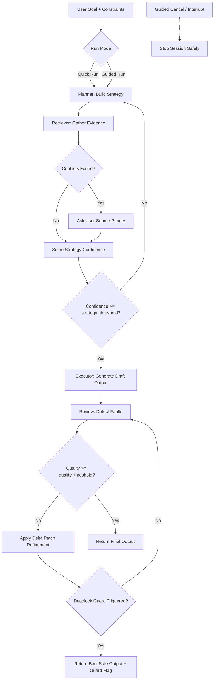

# FORGE Prototype (3-Agent)

For a non-technical setup walkthrough, use `README-BEGINNER.md`.

## Part 1: What it is, how it works, and what it uses

### What it is
FORGE is a 3-agent prototype for iterative problem-solving:
- Planner Agent
- Retriever Agent
- Executor Agent

It runs as a FastAPI backend with a built-in UI.

### How it works
- Two-phase loop:
  - Phase 1: Planner + Retriever (confidence-gated)
  - Phase 2: Executor + Devil's Advocate review (quality-gated)
- Constraint pinboard and activity log
- Delta patch refinement (targeted fixes)
- UI at `/` to run the pipeline interactively



### What it uses
- Python + FastAPI
- Azure OpenAI (required for LLM calls)
- Optional Bing Search v7 (for web retrieval)

### Latest updates (March 2026)
- Added dual run modes:
  - Quick Run (fully autonomous)
  - Guided Run (planner asks clarification questions each planning iteration)
- Added interrupt support:
  - UI Interrupt button
  - backend endpoint `POST /run/interactive/cancel`
- Added interactive run APIs:
  - `POST /run/interactive/start`
  - `POST /run/interactive/continue`
- Added planner reasoning summaries to activity logs (short, user-facing updates)
- Added conflict handling in planning:
  - when retriever finds conflicting sources, planner asks user to choose source priority
- Added ping-pong deadlock guard in Phase 2:
  - repeated consecutive fault IDs trigger `deadlock_guard_triggered`
- Added Tree-of-Thoughts planning in Planner:
  - generates multiple strategy paths, scores/prunes, and forwards the best path
  - includes fallback to legacy single-plan mode for reliability
- Updated UI:
  - output in scrollable panel
  - open output in new tab
  - guided panel visibility and input locking improvements
  - quick/guided button style consistency
- Added reusable smoke tests in `tests/smoke_test.py`

## Part 2: How to use it

### 1) Azure setup (required)

### A. Create Azure OpenAI resource
Create one Azure OpenAI resource in Azure Portal (or AI Foundry).

### B. Deploy a model
In **Model deployments**, create a deployment (recommended for credits: `gpt-4o-mini`).

Keep these values:
- Endpoint URL
- API key (Key 1 or Key 2)
- Deployment name (exact string)

### C. Optional retriever web search
Create Bing Search v7 resource and keep:
- `BING_SEARCH_API_KEY`
- `BING_SEARCH_ENDPOINT`

### 2) Configure environment

```powershell
cd "d:\ISB\microsoft case comp\forge-prototype"
Copy-Item .env.example .env
```

Update `.env`:

```dotenv
LLM_PROVIDER=azure
AZURE_OPENAI_API_KEY=<your_key>
AZURE_OPENAI_ENDPOINT=<https://your-resource.openai.azure.com/>
AZURE_OPENAI_API_VERSION=2024-10-21
AZURE_OPENAI_DEPLOYMENT=<your_deployment_name>

# optional
BING_SEARCH_API_KEY=<optional>
BING_SEARCH_ENDPOINT=https://api.bing.microsoft.com/v7.0/search
```

### 3) Run locally

```powershell
cd "d:\ISB\microsoft case comp\forge-prototype"
python -m venv .venv
.\.venv\Scripts\Activate.ps1
pip install -r requirements.txt
python -m uvicorn src.main:app --host 127.0.0.1 --port 8000 --reload
```

Open:
- UI: `http://127.0.0.1:8000/`
- Docs: `http://127.0.0.1:8000/docs`
- Health: `http://127.0.0.1:8000/health`

### 4) Use the app

- Quick Run: open the UI, enter goal/constraints, and run end-to-end autonomously.
- Guided Run: open the UI, start guided mode, answer planner questions each planning iteration, and continue until completion.
- Interrupt: use the UI interrupt button (or cancel API endpoint) to stop an in-progress guided run.

### 5) Test API quickly

```powershell
$body = @'
{
  "goal": "Create a 12-week product roadmap for a SaaS team",
  "constraints": [
    "Two compliance milestones by week 8",
    "Team capacity of 4 engineers",
    "Include assumptions explicitly"
  ],
  "config": {
    "strategy_threshold": 0.8,
    "quality_threshold": 0.85,
    "max_iterations": 3,
    "output_format": "markdown"
  }
}
'@
Invoke-RestMethod -Uri "http://127.0.0.1:8000/run" -Method Post -ContentType "application/json" -Body $body
```

## Security notes
- `.env` is ignored by `.gitignore`; never commit real keys.
- If any key was accidentally exposed, rotate it immediately in Azure Portal.

## Current limitations
- Session state is in-memory.
- Retriever uses placeholder evidence when Bing key is missing.
- Full cloud deployment (Container Apps, Cosmos DB, Service Bus) is not yet wired in this repo.
